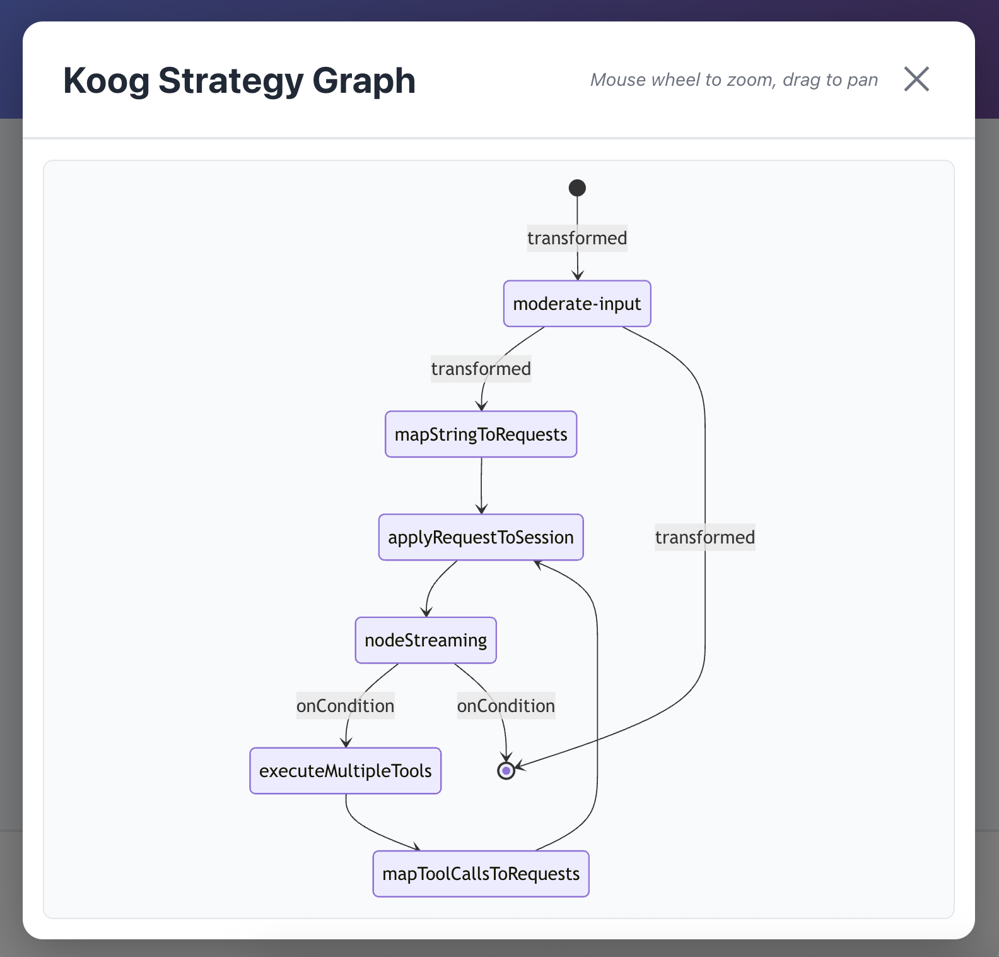
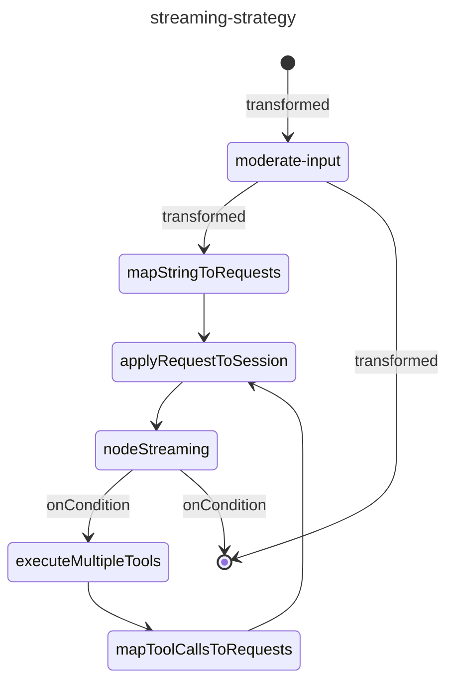

# Koog Spring-Boot Elven Assistant

[](https://github.com/kpavlov/koog-spring-boot-assistant/actions/workflows/maven.yml)
[](https://github.com/kpavlov/koog-spring-boot-assistant/actions/workflows/node.js.yml)

[**WEB UI**](https://kpavlov.github.io/koog-spring-boot-assistant/)

🎞️ Featuring in the ["Testing Challenges in the Age of AI"](https://m.devoxx.com/events/dvbe25/talks/25280/testing-challenges-in-the-age-of-ai) 
Devoxx Belgium 2025 talk
 - [Slides](https://speakerdeck.com/kpavlov/testing-challenges-in-the-age-of-ai-devoxx-dot-be-2025)

## Overview

An AI-powered conversational assistant demonstrating 
the [JetBrains Koog](https://github.com/jetbrains/koog) framework for building intelligent agents 
with Kotlin and Spring Boot. 
The application features an Elven-themed chatbot that combines RAG (Retrieval-Augmented Generation), 
session persistence, and real-time WebSocket communication.

**Key Features:**
- 🤖 **AI Agent Workflow**: Multi-node execution graph with input moderation, LLM processing, and conditional routing
- 💬 [**Interactive Chat UI**]((https://kpavlov.github.io/koog-spring-boot-assistant/)): Svelte-based web interface with real-time WebSocket messaging
- 📚 **RAG System**: Vector-based knowledge retrieval from markdown documents
- 🔍 **Observability**: Integrated OpenTelemetry tracing and metrics
- 💾 **Session Management**: Persistent conversation state with checkpoint recovery

**Testing:**
- 🧪 **Fast and deterministic integration testing** with [Mokksy.dev](https://mokksy.dev). **Run them on the plane ✈️!!!**
- 🧫 **Prompt Evaluation**: Promptfoo integration for testing and optimizing LLM prompts

**Tech Stack:** Spring Boot 3.5 • Kotlin 2.2 • [JetBrains Koog](https://github.com/jetbrains/koog) • [Mokksy.dev](https://mokksy.dev)• WebFlux • Svelte, OpenAPI

<div style="max-height: 80vh; display: inline-flex">

[](https://kpavlov.github.io/koog-spring-boot-assistant/)

</div>

<div style="max-height: 80vh; display: inline-flex">

[](https://kpavlov.github.io/koog-spring-boot-assistant/)

</div>

## Quickstart

You may find the instructions also on [**WEB UI**](https://kpavlov.github.io/koog-spring-boot-assistant/)

### Prerequisites
- Java 17+ (JDK). Using the same JDK as your IDE is recommended.
- Maven 3.9+
- macOS with Homebrew for installing optional tools (or install those tools manually on your platform).

### 1) Create your environment file first
The project includes a template for environment variables.

- Copy the template and edit values as needed:
  ```shell
  cp .env.template .env
  ```
- At minimum, ensure your OpenAI key is available to tools that read from `.env`.
  In `.env` add: `OPENAI_API_KEY=sk-...`

### 2) Define secrets in application properties
The Spring app reads secrets from `app/config/application.properties`.

- Open app/config/application.properties and set your key(s), for example:
    ```properties
    OPENAI_API_KEY=sk-...
    ```
<summary>
<description>
Note: Do not commit real secrets.
</description>
The repo may contain a template, but ensure your local file is ignored by VCS.

Run 
```shell
gitleaks git .
```
or 
```shell
make no-leaks
```
to make sure your secrets are not gonna be commited.
</summary>

### 3) Build the project with Maven
Build the Spring Boot application (module `app`) using Maven:

```shell
mvn clean package
```

This will produce a runnable jar under `app/target/`.

### 4) Run the project

You can run the app from your IDE (IntelliJ IDEA is recommended) or via Maven.

- **Before opening a project in the IDE, please make sure you have generated sources and resources,
like API classes from OpenAPI, and `build-info.properties`:**
    ```shell
    mvn generate-resources
    ```
- IntelliJ IDEA: Open the project, select the `Application.kt` run configuration (module `app`), and Run.
- Start server:
  ```shell
  mvn spring-boot:run -pl :app
  ```
  or
  ```shell
  make run
  ``` 

- Open [Web UI](https://kpavlov.github.io/koog-spring-boot-assistant/).
  To build and run it locally:
    ```shell
    cd chat-ui && npm run dev 
    ```
    or
    ```shell
    make ui
    ```

### 5) Observability: run OpenTelemetry TUI
Use the Makefile target to launch the [OpenTelemetry terminal UI (otel-tui)](https://github.com/ymtdzzz/otel-tui). 
This target also cleans any process already bound to the default port.

```shell
make otel
``` 

Tip: If you don't have the tool, run the `prepare` target first to install it.

```shell
make prepare
``` 

### 6) Evaluate prompts with Promptfoo
Promptfoo commands are wrapped in Makefile targets and read environment from the `promptfoo/.env` file if present.

- Start a continuous evaluation and write results to `promptfoo/output.yml`:

    ```shell
    make pf-e2e
    ``` 
- Launch the Promptfoo UI to explore results:

    ```shell
    make pf-e2e-ui
    ```

## Troubleshooting
- Ensure `OPENAI_API_KEY` is present in both `.env` (for tools) and `app/config/application.properties` (for the Spring app).
- If Maven cannot find Java, confirm `JAVA_HOME` points to a JDK (not a JRE).
- If otel-tui or promptfoo are missing, run `make prepare` (macOS/Homebrew) or install them manually.

--- 

## Project Design

This project demonstrates an AI-powered conversational assistant built with Spring Boot and the [Koog](https://github.com/kpavlov/koog) framework. The design follows a modular architecture with clear separation of concerns.

### Architecture Overview

The application consists of three main layers:

1. **API Layer** (`app/src/main/kotlin/com/example/app/api/`)
   - REST endpoints defined via OpenAPI specification (`docs/openapi.yaml`)
   - Controllers implement generated API interfaces
   - Reactive endpoints using Spring WebFlux with Kotlin coroutines

2. **Agent Layer** (`app/src/main/kotlin/com/example/app/agents/`)
   - **ElvenAgent**: Core AI agent orchestrating LLM interactions
   - Uses Koog framework's agentic workflow with:
     - Input moderation via OpenAI's Moderation API
     - RAG (Retrieval-Augmented Generation) for context-aware responses
     - Session persistence and checkpoint recovery
   - Implements multi-node execution strategy with conditional routing

3. **Infrastructure Layer**
   - **RAG Configuration**: Vector embeddings for knowledge base search
   - **Prompt Management**: Template-based prompts loaded from filesystem
   - **Observability**: OpenTelemetry integration for tracing and metrics

### Key Components

#### AI Agent Workflow
The agent implements a node-based execution graph with tool calling capabilities:



#### RAG System
- Knowledge base: Markdown files in `app/data/knowledge/`
- Embedding storage: JVM-based vector store
- Retrieves top 3 relevant documents per query
- Uses OpenAI's `text-embedding-3-small` model

#### Prompt Templates
- Stored in `app/data/prompt-templates/`
- Versioned templates (e.g., `elven-assistant/system/latest.md`)
- Loaded dynamically via `JVMFilePromptTemplateProvider`

#### Session Management
- Persistent conversation state
- Automatic checkpoint creation
- Message history preservation on restore
- Storage path: `./target/tmp/session-store`

### Technology Stack
- **Framework**: Spring Boot 3.5.6 with WebFlux
- **Language**: Kotlin 2.2.20
- **AI Framework**: Koog 0.5.0-rc
- **LLM Provider**: OpenAI (GPT-4 Mini for cost optimization)
- **Build Tool**: Maven 3.9+
- **Observability**: OpenTelemetry, Micrometer
- **Testing**: Kotest, MockK, AI-Mocks (mokksy)

### Design Patterns
- **Code Generation**: OpenAPI → Kotlin Spring interfaces
- **Dependency Injection**: Spring's constructor-based injection
- **Reactive Programming**: Kotlin coroutines with WebFlux
- **Feature Composition**: Koog's plugin system (Persistence, OpenTelemetry, Tracing)
- **DSL Builders**: Fluent prompt and agent configuration

## Useful paths
- Application entry point: [Application.kt](app/src/main/kotlin/com/example/app/Application.kt)
- AI Agent: [ElvenAgent.kt](app/src/main/kotlin/com/example/app/agents/ElvenAgent.kt)
- REST Controller: [ChatController.kt](app/src/main/kotlin/com/example/app/api/ChatController.kt)
- Spring config: [application.yml](app/src/main/resources/application.yml)
- External properties: [application.properties](app/config/application.properties)
- OpenAPI spec: [openapi.yaml](docs/openapi.yaml)
- Knowledge base: [app/data/knowledge/](app/data/knowledge/)
- Prompt templates: [app/data/prompt-templates/](app/data/prompt-templates/)
- Prompt scenarios: [scenarios](promptfoo/scenarios)

